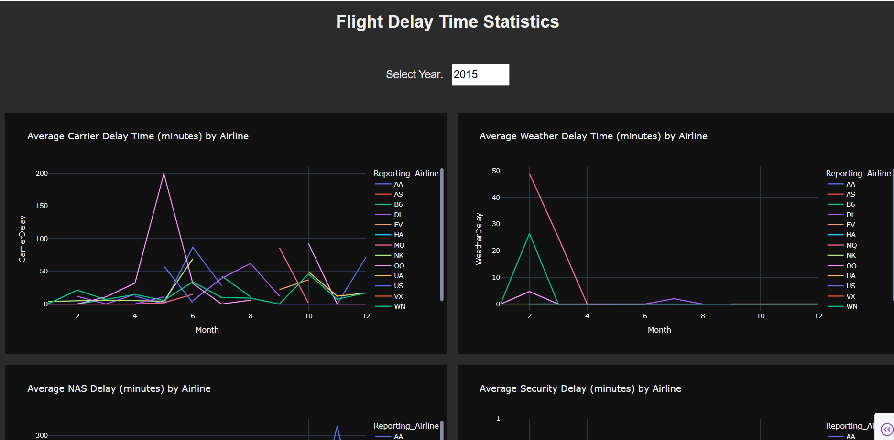

# <b>✈️ Flight Delay Dashboard — Dash & Plotly</b>  

  
  
  
  

<p align="center">
  
</p>  

An interactive analytics dashboard for exploring **U.S. flight delay causes** between 2010–2020.  
Built with **Dash + Plotly**, the project demonstrates **dashboard engineering, data visualization, and storytelling with data**.  
Designed to be **interview-ready**, with emphasis on **clarity, reproducibility, and professional presentation**.  

---

## <b>📂 Project Structure</b>  

├── python_flight_delay_vscode.py # Main Dash application
├── dashboard_layout.png # Dashboard overview screenshot
├── carrier_delays.png # Carrier delay plot
├── weather_delays.png # Weather delay plot
├── nas_security.png # NAS & Security delay plot
├── late_delays.png # Late aircraft delay plot
├── README.md # Project documentation

markdown
Copy code

---

## <b>⚙️ Skills & Tech</b>  

- **Languages:** Python  
- **Libraries:** Pandas, Plotly, Dash  
- **Visualization:** Interactive line charts, dark theme, hover tooltips  
- **Dashboarding:** Dash callbacks, responsive multi-plot layout  
- **Environment:** VS Code, auto browser launch  

---

## <b>📝 Project Overview</b>  

This project builds an **interactive dashboard** that helps analyze causes of flight delays.  

**Workflow highlights:**  
1. **Data Loading** — U.S. flight delay dataset (2010–2020)  
2. **Computation** — Aggregating monthly averages for each delay type  
3. **Dashboard UI** — Year selector + five interactive plots  
4. **Interactivity** — Real-time updates when a year is selected  

**<b>Delay categories analyzed:</b>**  
- Carrier  
- Weather  
- NAS (National Airspace System)  
- Security  
- Late Aircraft  

---

## <b>📊 Dataset</b>  

- **Source:** [U.S. Department of Transportation – Bureau of Transportation Statistics](https://www.transtats.bts.gov/)  
- **Records:** ~500,000 flight records  
- **Features:**  
  - `Year`, `Month`, `Reporting_Airline`  
  - `CarrierDelay`, `WeatherDelay`, `NASDelay`, `SecurityDelay`, `LateAircraftDelay`  

5. **Results **
   ## 📊 Results

## 📊 Results

The dashboard provides interactive insights into different causes of flight delays.  
Below are example visualizations generated from the app:

### 🛫 Carrier Delays


### 🌦️ Weather Delays


### 🛰️ NAS & Security Delays


### ✈️ Late Aircraft Delays


---

### 📌 Full Dashboard Layout


## <b>▶️ How to Run</b>  

1. Clone this repository:  
   ```bash
   git clone https://github.com/Shamir-Havas/Flight_Delay-Dash-Plotly.git
   cd Flight_Delay-Dash-Plotly
Install dependencies:

bash
Copy code
pip install pandas dash plotly
Run the application:

bash
Copy code
python python_flight_delay_vscode.py
Open in browser:

cpp
Copy code
http://127.0.0.1:8050/
<b>📊 Results & Dashboard</b>
🔹 Carrier Delay Trends

🔹 Weather Delay Trends

🔹 NAS & Security Delays

🔹 Late Aircraft Delay Trends

<b>🔍 Insights</b>

Carrier delays rise in summer due to higher passenger volumes.

Weather delays peak in winter, especially for northern hubs.

NAS delays consistently impact all airlines.

Security delays are rare but disruptive when they occur.

Late aircraft delays are a major contributor across all years.

<b>🚀 Future Improvements</b>

Deploy live dashboard (Heroku / Render)

Enhance UI with advanced filtering (airport, airline)

Integrate ML models to predict delays

Add economic impact analysis of delays

<b>📦 Requirements</b>

pandas==2.0.3  
plotly==5.17.0  
dash==2.15.0  
